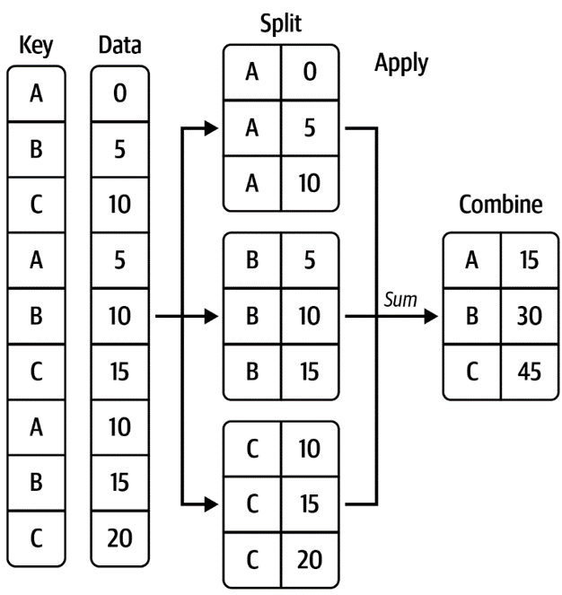

# Portfolio

# Científico de datos / Analista de datos
### Certificaciones y cursos
### Experiencia laboral
- Empresa 1
- Empresa 2

### Proyectos
- [Agregaciones](agregaciones/notebooks/Aggregations.ipynb) con Pandas utilizando Jupyter Notebook

- Proyecto 2

  
